# Как начать работу с GalenIT SDK

> Минимальные требования проекта Android:
> - Поддержка с набором инструкций процессора Arm64-v8a.
> - Поддержка с уровнем API 27 и выше.
> 
## Шаг 1. Получите необходимые файлы и ключ для работы с GalenIT SDK
Отправьте письмо на почту [info@it-galen.com](mailto:info@it-galen.com) с запросом о 
предоставлении GalenIT SDK для вашей организации. Дальнейшие инструкции придут на почту.

Полученный ключ можно использовать для работы в нескольких приложениях.


## Шаг 2. Подключить и сконфигурировать предоставленные библиотеки:
Рассмотрим конфигурацию проекта на примере Android Studio.
1. Создайте новый Andoid-проект, используя встроенного помощника Android Studio
2. Создайте конфигурационный файл **local.properties** и пропишите в нем свойство **galenit.token**
   со значением предоставленного вам лицензионного ключа.
   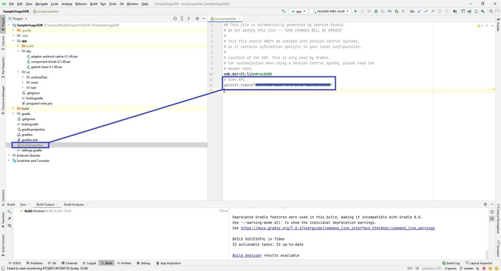
3. В корневом конфигурационном файле **settings.gradle** подключите репозитории.
   ```bash
   repositories {
     google()
     mavenCentral()
   }
   ```
   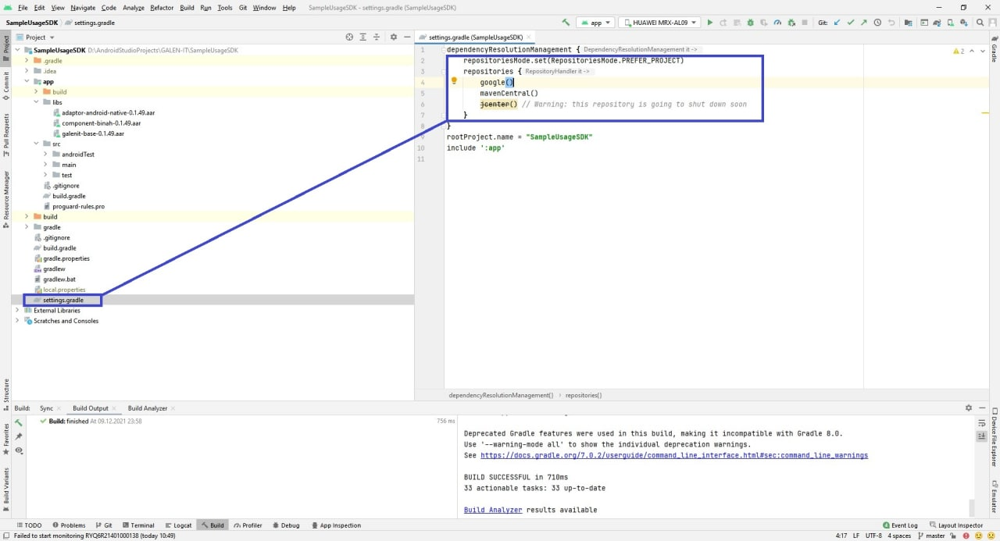
4. Пропишите минимальную версию SDK, и сконфигурируйте переменную токена в файле основного модуля проекта **build.gradle**
   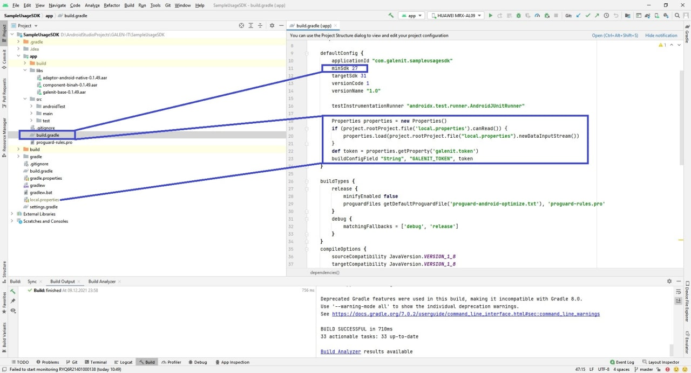
5. Создайте директорию _"libs"_ в корне вашего основного модуля и скопируйте туда предоставленные .aar файлы
6. Добавьте необходимые зависимости в файле **build.gradle** вашего основного модуля
   ```gradlew
      dependencies {
         // Подключаем предоставленные библиотеки
         implementation fileTree(include: ['*.aar'], dir: 'libs')
         ...
         implementation "org.jetbrains.kotlinx:atomicfu:0.16.3"
         implementation "org.jetbrains.kotlinx:kotlinx-datetime:0.3.1"
         implementation "org.jetbrains.kotlinx:kotlinx-coroutines-core:1.5.2-native-mt"
         implementation "org.jetbrains.kotlinx:kotlinx-serialization-core:1.3.0"
         implementation "org.jetbrains.kotlinx:kotlinx-serialization-json:1.3.0"
         implementation "com.google.mlkit:face-detection:16.1.2"
         implementation "com.babylon.certificatetransparency:certificatetransparency-android:0.2.0"
      }
   ```
7. Синхронизируйте проект, чтобы применить изменения. Например, в Android Studio можно нажать Sync Now или выбрать в меню File → Synchronize. Дождитесь окончания синхронизации.
8. SDK готов к внедрению.

Если синхронизация завершилась успешно, при компиляции библиотека будет добавлена в проект автоматически. При ошибке компиляции, убедитесь что вы правильно указали репозиторий и зависимость и синхронизируйте проект снова.

## Шаг 3. Настройка C++ и NDK:
Чтобы ваш Android мог работать с нашими собственными библиотеками C++, вам необходимо установить NDK, поддерживающий C++17.

Необходимо установить NDK версии 20 и выше (рекомендуем: 20.1.5948944)

1. Откройте Android Studio
2. Перейдите в раздел Tools -> SDK Manager
   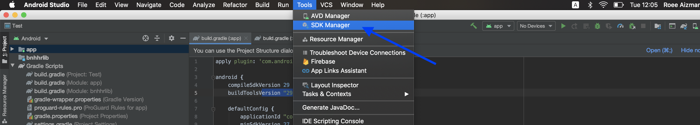
3. На следующем экране в разделе "Android SDK" выберите "SDK Tools" и установите флажок "Show Package Details".
   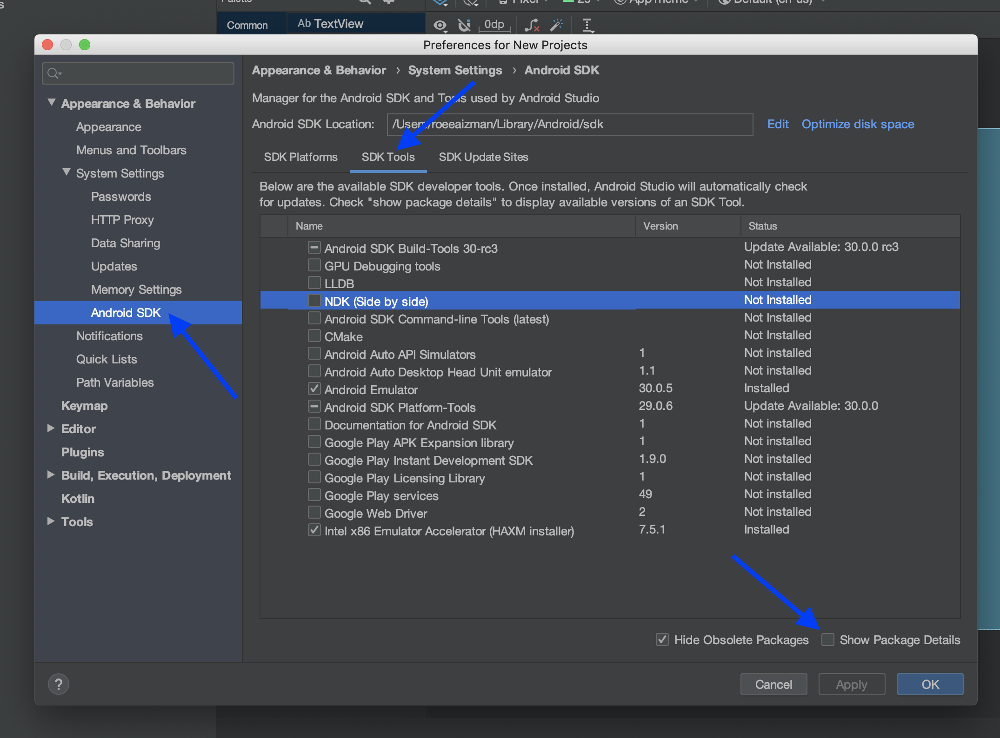
4. Прокрутите вниз до раздела "NDK (Side by side)" и выберите правильную версию NDK (20.1.5948944)
   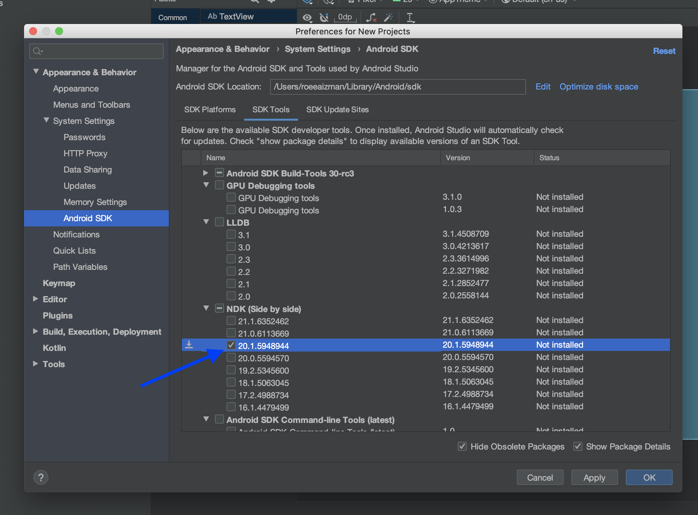
5. Нажмите "ОК", чтобы начать установку и примите следующий экран:
   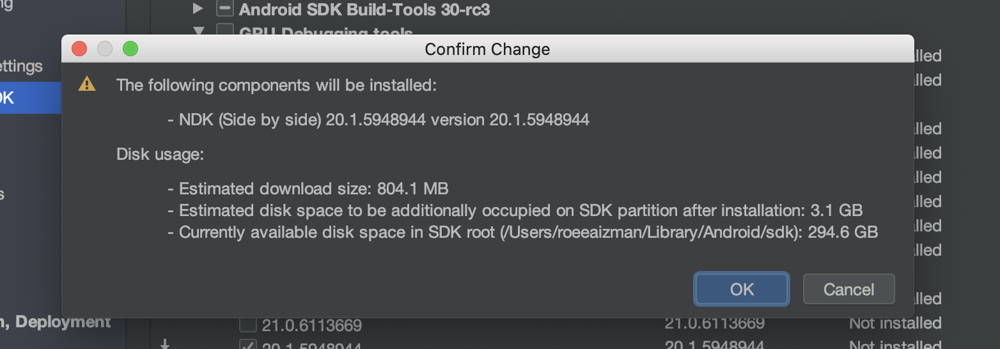
6. Начнется установка NDK. Вы можете переместить это окно в фоновый режим, нажав на кнопку "Background".
   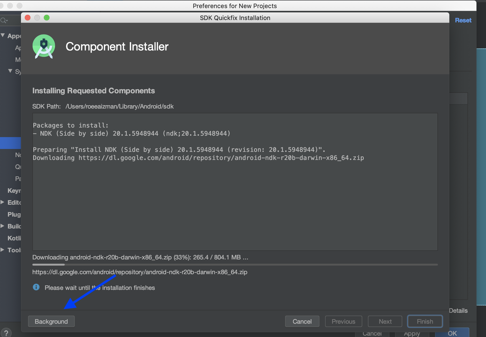

## Шаг 4. Реализация:
1. Откройте Java-файл _MainActivity_ и импортируйте библиотеку;
   ```kotlin
   import com.galenit.device.api.lib.GalenIT
   ```
2. Когда вы начнете печатать, вы получите окно автоматического завершения (что означает, что SDK был добавлен):
   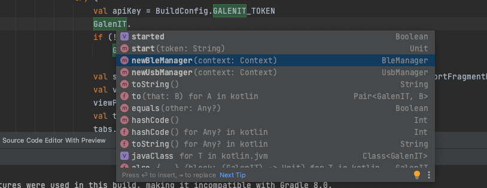
3. Инициализируйте библиотеку передав в нее ваш токен
   ```kotlin
   val apiKey = BuildConfig.GALENIT_TOKEN
   if (!GalenIT.started)
    GalenIT.start(apiKey)
   ```

## Настройка конфигураций build/deployment (APK или bundle APK):
1. Добавьте следующую строку кода в файл **gradle.properties**:
   ```gradle
   android.bundle.enableUncompressedNativeLibs=false
   ```
2. Перейдите к конфигурации **Run/Debug**
   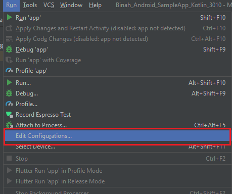
3. Выберите приложение
4. Измените Installation Options-> Deploy from “Default APK” на “APK from app bundle”
   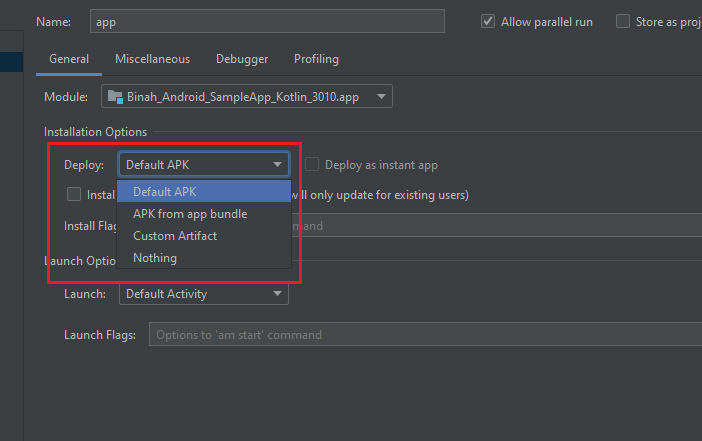
5. Запустите проект на реальном устройстве, чтобы проверить, работает ли конфигурация

> Примечание:
>
> Запускайте приложение на реальном устройстве для тестирования так как оно не будет работать на эмуляторе
>
> Google предпочитает публиковать в Google Play пакет приложений для Android. Чтобы узнать больше о пакетах приложений для Android, пожалуйста, перейдите по этой [ссылке](https://developer.android.com/guide/app-bundle).
