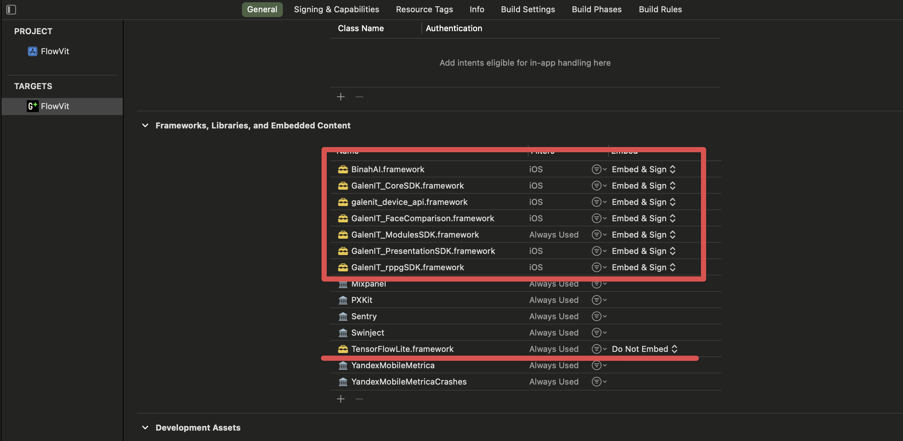
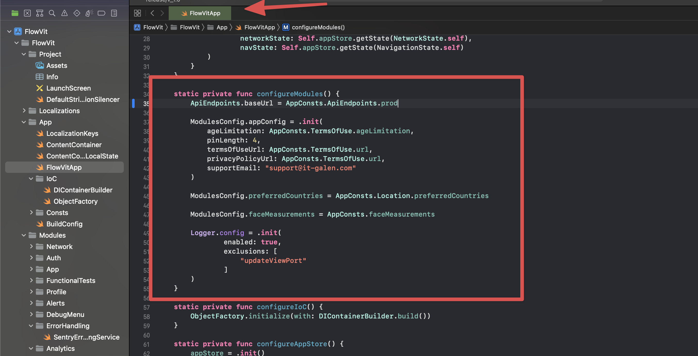
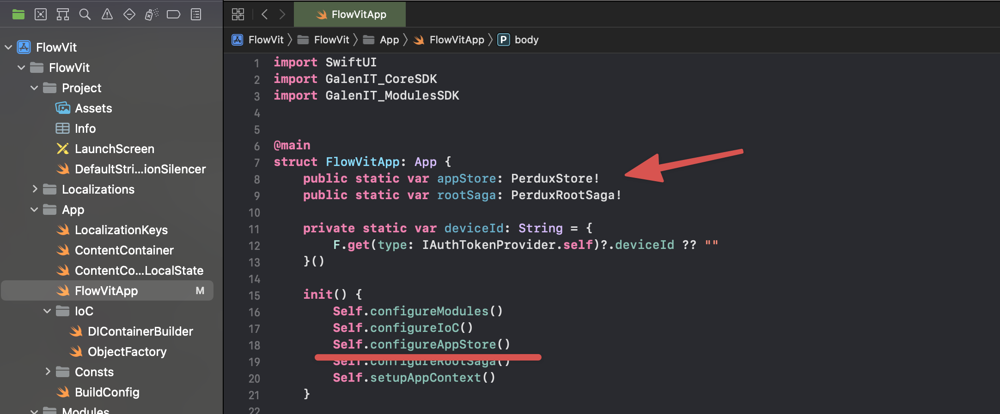
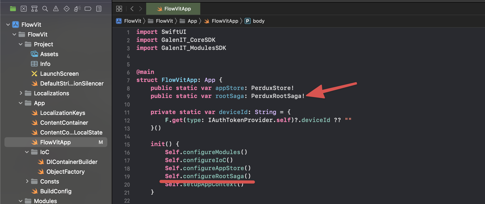
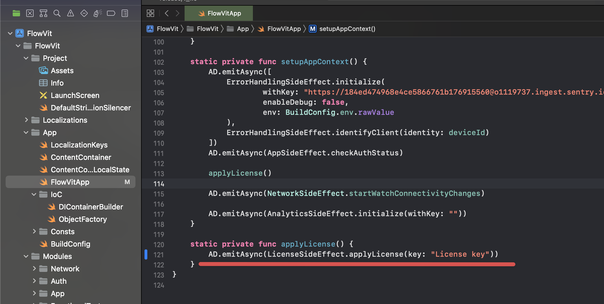
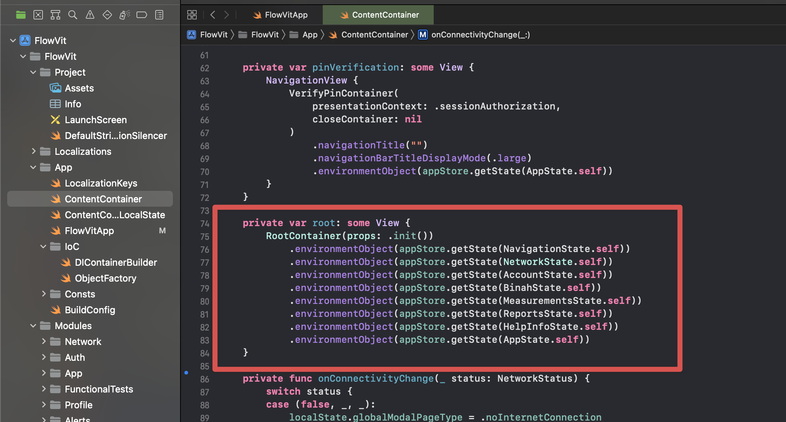
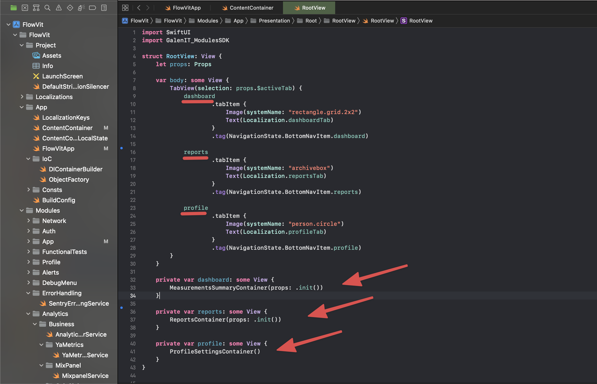
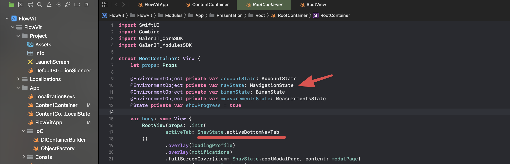

# Getting Started

- create an app or use previously created app

- add frameworks to the App Target

  embed and sign frameworks

- update info.plist with required permissions (Camera, Bluetooth)

- configure modules 
  - configure logger
  - configure api
  - configure modules

- configure Application Store
  - create Application Store instance in your app
  - add states from Modules.SDK
  - implement your own states based on Core.SDK State

- configure RootSaga
  - create rootSaga instance in your app
  - add Sagas from Modules.SDK
  - resolve dependencies via Modules.SDK or implement your own ones

- apply your license key

- add States to environmentalObjects inside your integration RootContainer for every navigation stack
  - in example: 
    - IntegrationContainer.environmentObject(appStore.getState(VitalMetricsState.**self**))
    - **Note**: *if you app based on Controllers, you can get states right from AppStore on the controller lifecycle delegates*

- add your root navigation across GalenIT Modules
  - GalenIT.Modules already have a UI for the modules

- GalenIT.Modules already have NavigationState with available page types, but it's possible to use the own one

