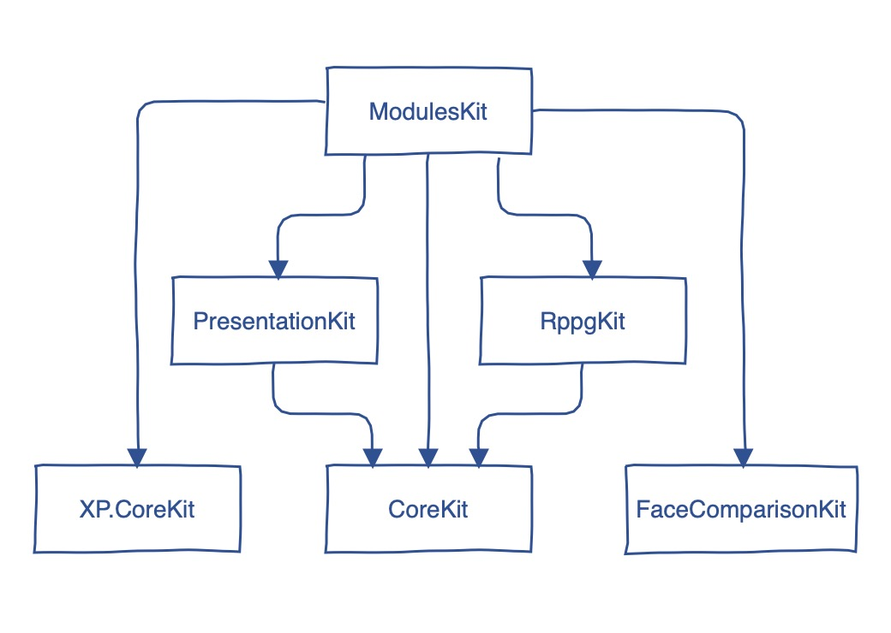

# SDK description
### GalenIT.XP.CoreKit
- Bluetooth device adaprots
- License management
- USB device adaptors

### GalenIT.CoreKit
- API utils
- Common helpers
- Country utils
- Country Location utils
- Data type extensions
- Network utils
- Permission management utils
- Phone utils
- Secure storage utils
- Redux architecture pattern implementation

### GalenIT.PresentationKit
- UI Components
- UI Environment variables
- UI Modifiers
- UI utils

### GalenIT.FaceComparisonKit
- Face extractors
- Face checkers
- Face comparators

### GalenIT.RppgKit
- rPPG measurement service

### GalenIT.ModulesKit
- Account module
- Analytics module
- Application module
- Auth module
- Error handling module
- Functional tests module
- Help module
- License management module
- Medical devices module
- Profile settings module
- Reports module
- Vital measurements module

# Module dependencies

# Modules XCode documentation

* [CoreSDK](./resources/GalenIT_CoreSDK.doccarchive)
* [PresentationSDK](./resources/GalenIT_PresentationSDK.doccarchive)
* [FaceComparisonSDK](./resources/GalenIT_FaceComparison.doccarchive)
* [RppgSDK](./resources/GalenIT_rppgSDK.doccarchive)
* [ModulesSDK](./resources/GalenIT_ModulesSDK.doccarchive)